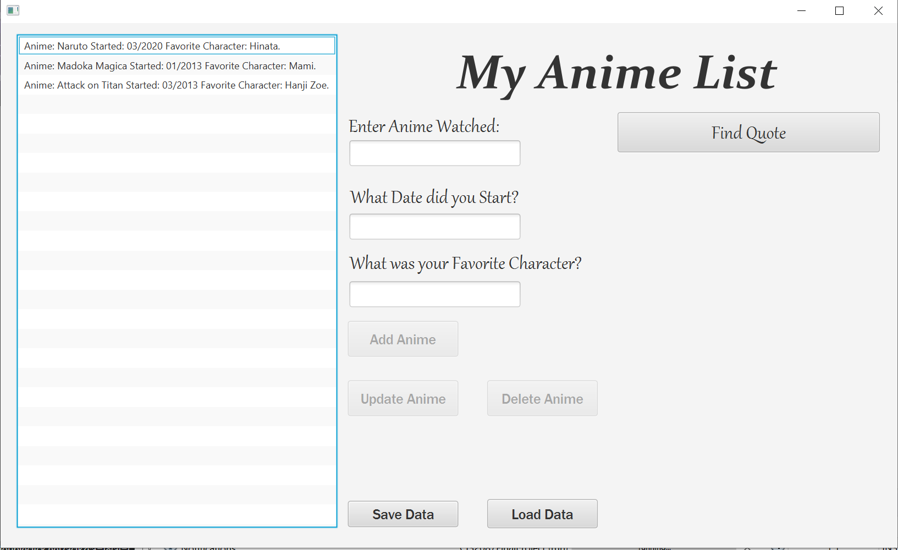

<!-- layout: page
title: "animelist"
permalink: /projects/animelist/ -->

# Scenebuilder with API List (MyAnimeList)

I built this program using the IDE Netbeans in the language of Java. The GUI was built in the JavaFX program called scenebuilder. 

- I used an FXML document controller to add functionality to the buttons, list view, and text boxes. 

- It uses an API that is filled with quotes from anime shows, the API is sorted by the title of the anime. Using gson and json I called the API based on the 
name of the anime you would enter into the text box. 

##### [the repository](https://github.com/jmorrison11/MyAnimeList)
###### [back to home](jmorrison11.github.io)
###### [back to project list](https://jmorrison11.github.io/projects)
