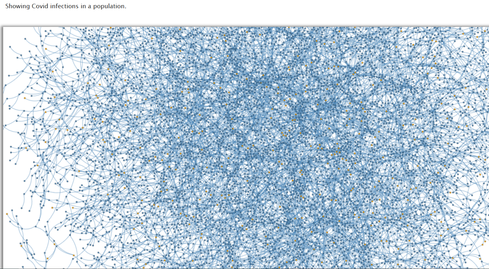

<!-- layout: page
title: "covidtracing"
permalink: /covidtracing/ -->

# List Interfaces and Bridges
#### This is a "COVID" tracing program (This isn't real COVID data)

This was built using the IDE Netbeans in Java with ANT. And the visualization was made using http://bridges-cs.herokuapp.com/. 

- We were taking a large dataset of 10,000 "users" and a very large log of what users had contacts with others. That is what build the "edges" of the visualization. 
  - The users were placed into a large arraylist using the list interface by loading from a data file called users in the project. 
  - The contacts were also loaded from a data file in the project. 
  - The users were sorted by ID number and colored in the visualization; yellow means that they are infected. 
  - By using a binary search I was able to create edges between those people who had had contact with each other in the last two weeks. 

##### I couldn't make a repository because the files were too large
###### [back to home](jmorrison11.github.io)
###### [back to project list](https://jmorrison11.github.io/projects)
