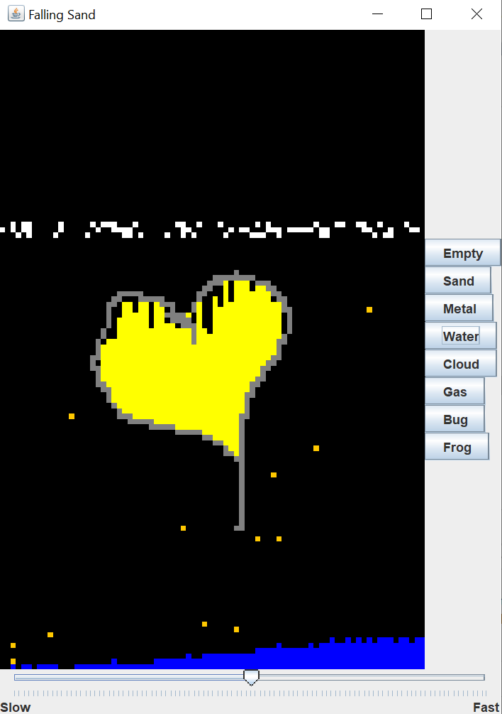

<!-- layout: page
title: "fallingsand"
permalink: /fallingsand/ -->

# Demonstration of Object Orientated Programming (Falling Sand)
I built this program using the IDE Netbeans in the language of Java.

- This project was as a simple game, creating small particles of material things on a game board.
  - All of the particles have different movement and interactive qualities. 
  - The particles were objects themselves.
    - This made it simple to change the name of them, their color, and to add the movement to them. We were only using simple setters and getters. 
  - The movements were also a separate object.
    - Theses were catagorized as a row change and column change. Those adding them to the particle class we were only using the terms right, left, down, and up. 
    - We would use the AddMovement method on a particle.
  - The relationship between the particles were also a separate object. 
    - This was the fun part of deciding who wins the rock, paper, scissors game. 
    - Deciding if the particle objects would sit on top of each other or fall through each other. 

##### [the repository](https://github.com/jmorrison11/FallingSand)
###### [back to home](jmorrison11.github.io)
###### [back to project list](https://jmorrison11.github.io/projects)
